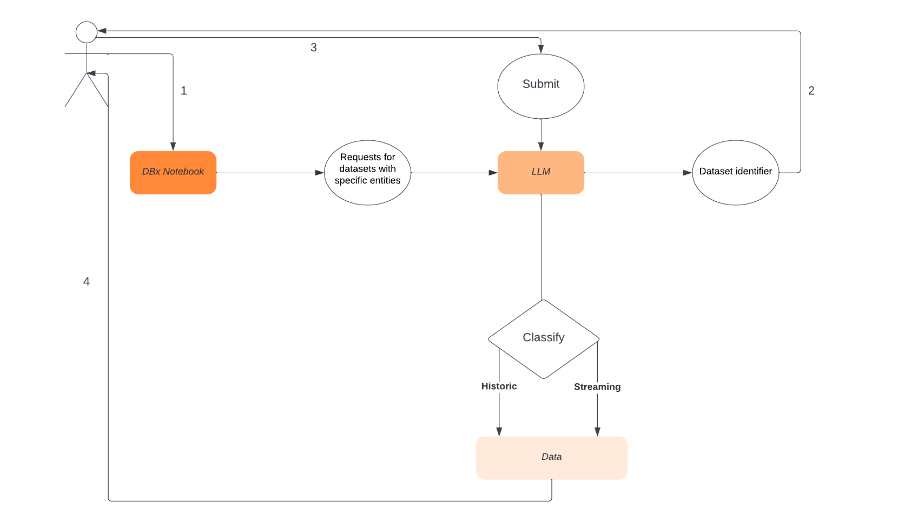

# ndl-dbx-hackathon-2023

Nasdaq Data Link Submission for Databricks Hackathon 2023

## Objective

[Nasdaq Data Link](https://data.nasdaq.com/) is a marketplace for financial data. Users can consume datain various ways, such as through API, SDKs (Python/R/Ruby), Excel plugin.

The objective of this project is to facilitate non-technical users to navigate data products in NDL. Specific goals are:

1. Users can use natural language to explore NDL data offerings that fit their use case, i.e. return the NDL datatable code that fits their use case

2. Users can explore specific datatable using natural languange prompts. The LLM will return a SQL query that answers this prompt, which will them executed against NDL data warehouse. 

Example Prompts:

1. What table has trades data?

2. What is the volume of NDAQ traded in the SeqTradeReportMessage table?

## Structure

1. The project is built on Databricks using OpenAI, and langchain.

2. When a user prompts the notebook, we prompt against our metadata file to determine the correct table. We then generate a SQL query which connects to the Data Link API and returns results to the user.

## Use Cases

User onboarding becomes exponentially more difficult as the number of datasets grows. This tool is designed to give users with zero knowledge of our catalog relevant insights.
